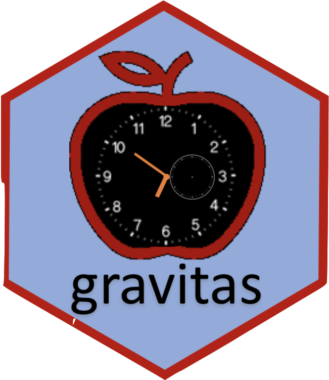
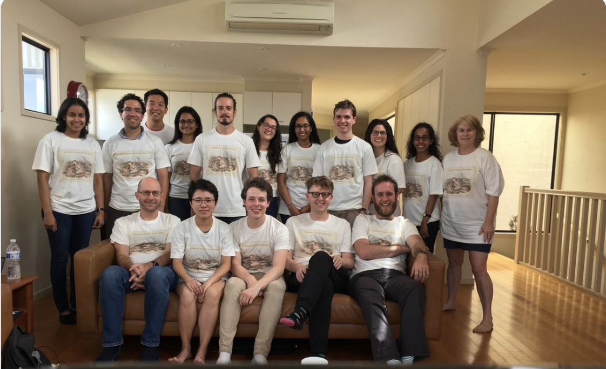

```{r setup, include=FALSE}
library(knitr)
options(htmltools.dir.version = FALSE, tibble.width = 55, tibble.print_min = 4)
opts_chunk$set(
  echo = FALSE, warning = FALSE, message = FALSE, comment = "#>",
  fig.path = 'figure/', cache.path = 'cache/', fig.align = 'center', 
  fig.width = 12, fig.show = 'hold', fig.height = 7, # 16:9
  cache = TRUE, external = TRUE, dev = 'svglite'
)
read_chunk('R/theme.R')
read_chunk('R/main.R')
```

```{r xaringan-themer, include = FALSE}
library(xaringanthemer)
 solarized_dark(
   header_font_google = google_font("Josefin Sans"),
   text_font_google   = google_font("Montserrat", "300", "300i"),
   code_font_google   = google_font("Droid Mono"),
   # header_color = "#00aba9",
   # text_color = "#2b5797"
   # # header_color = "#00008B",
   # text_color = "#8B4513"
  header_color = "#ffbb33",
  # text_color = "#FFDAB9",
  text_color = "White",
  background_color = "#555555",
  #title_slide_background_color = " #D9D690"
 )
```
  

<!-- SLIDE 1 -->
# Electricity smart meter technology  (~ 40 billion half hourly observations)

<!-- .pull-left[ -->
<!-- .center-left[ -->
- Source : Department of the Environment and Energy, Australia
<br>
<br>
- Frequency:  Half hourly (interval meter reading (Kwh))
<br>
<br>
- Time Span: 2012 to 2014
<br>
<br>
- Spread: 14K (approx.) households based in Newcastle, New South Wales, and parts of Sydney
<br>
<br>

???
Smart meters record electricity usage (per kWh) every 30 minutes and send this information to the electricity retailer for billing

**Consumers** can save considerable amount on their electricity bill by 
- Switching on their hot water heater or do laundry when energy is cheaper, or when their solar system is generating surplus energy 
- Switching off appliances during peak demands
- Check usage and compare with similar homes 

**Retailers** can reduce costs and increase efficiency
- Lowering metering and connection fees 
- Drawing insights into when customer is home, or sleeping, or even what appliances they are using based on usage figures
- Rewarding customers for mindful usage

Just to give you some perspective I have this data from Department of Energy and Environment, Australia that provides interval meter reading data every 30 minutes from 2012 to 2014. So you can think of it like, that the finest temporal unit here is half hour, whereas the coarsest temporal unit is year. This data is made available for 14k customers located in different local government areas across places.. So this is a data which is spread across both time and space and hence is a spatio-temporal data. 

---
<!-- class: hide-slide-number -->

<!-- SLIDE 1 -->
## Visualize the raw data from from 2012 - 2014 for 50 households

```{r load}

```


```{r motivation3}
```

---
class: center, middle
<!-- class: hide-slide-number -->

<!-- SLIDE 2 -->

## Periodic behavior -  One household?

<!-- in half-hourly energy usage for 1 household from 2012 to 2014 -->

.pull-left[
## **Linear scale** 
<br>
<br>
<large> `r emo::ji("arrow_down")`
<br>
<br>
## **Periodic scale**
]

.pull-right[
`r par(mfrow = c(1, 2))`
```{r motivation4}
```

```{r motivation5}
```
]

## $Time\ restructuring \equiv Data \ restructuring$
---

## Many households?

```{r motivation6, out.height="100%"}
```

---
# Summarizing data
<br>
<br>
<!-- SLIDE 3 -->
```{r dino-saurus}
include_graphics("images/dino-saurus.gif")
```

.footnote[
["Same Stats, Different Graphs: Generating Datasets with Varied Appearance and Identical Statistics through Simulated Annealing"](https://www.autodeskresearch.com/publications/samestats)
]
<!-- -- [Nick Tierney, WOMBAT2019](https://github.com/njtierney/wombat19) -->
---
# Summarize distributions induced by multiple observations
.checked[
<br>
<br>
* **Avoid loss of information due to excessive aggregation**
<br>
<br>
* **Dimension reduction**
<br>
<br>
* **Capture shape and uncertainty**
<br>
<br>
* **Alleviate the impact of outlier behavior (eg. different holidays)**
]

<!-- -- [Nick Tierney, WOMBAT2019](https://github.com/njtierney/wombat19) -->
---

class: center,middle

<!-- SLIDE 4 -->

#  Research aim 

## **How do we systematically explore large quantities of temporal data across different deconstructions of time (half-hour, day, type of day, year) to find regular patterns or anomalies in behaviour?**

<!-- ## **Solution** :  Visualize probability distributions over different time granularities. -->
---
#  Research objectives : 

- ## **Visualize probability distributions over different time granularities for one or few individuals**

- ## **Clustering temporal data across cyclic granularities based on probability distribution similarity**

- ## **Study of Australian smart meter data**

---

.left-column[
## Timeline
### - 2019
]
.right-column[
.timeline.timeline-left.timeline-with-arrows[
.timeline-block[

.timeline-block[
.arrow-right[
.timeline-content[
Candidature Confirmation
.timeline-date[
2019/02
]]]]

.timeline-block[
.arrow-right[
.timeline-content[
Internship with Google Summer of Code working on R package `gravitas` and Shiny App
.timeline-date[
2019/05 - 2019/08
]]]]

.timeline-block[
.arrow-right[
.timeline-content[
Presented at Young Statistician's Conference -  
won the 2nd best Presentation award `r emo::ji("trophy")`
.timeline-date[
2019/10
]]]]

.timeline-block[
.arrow-right[
.timeline-content[
R package `gravitas` on CRAN
.timeline-date[
2019/11
]]]]

.timeline-block[
.arrow-right[
.timeline-content[
R package `gghdr`: graphing highest density regions using `ggplot2` at rOpenSci 
.timeline-date[
2019/12
]]]]


.timeline-block[
.arrow-right[
.timeline-content[
Presented at International Indian Statistical Association 
.timeline-date[
2019/12
]]]]

]
]
]

---

.left-column[
## Timeline
### - 2019
### - 2020
]
.right-column[
.timeline.timeline-left.purple-flirt.timeline-with-arrows[


.timeline-block[
.arrow-right[
.timeline-content[
Mid-Candidature Review
.timeline-date[
2020/03
]]]]


.timeline-block[
.arrow-right[
.timeline-content[
R package `gghdr` to be submitted on CRAN 
.timeline-date[
2020/03
]]]]


.timeline-block[
.arrow-right[
.timeline-content[
Paper to be submitted to Journal of Computational and Graphical Statistics (JCGS)
.timeline-date[
2020/04
]]]]

.timeline-block[
.arrow-right[
.timeline-content[
useR! 2020 (Tentative)
.timeline-date[
2020/07
]]]]

.timeline-block[
.arrow-right[
.timeline-content[
Compstat 2020 (Tentative)
.timeline-date[
2020/08
]]]]

.timeline-block[
.arrow-right[
.timeline-content[
R package and Draft paper of Research objective-2 ready
.timeline-date[
2020/10
]]]]
]
]

---

.left-column[
## Timeline
### - 2019
### - 2020
### - 2021
]

.right-column[
.timeline.timeline-left.purple-flirt.timeline-with-arrows[

.timeline-block[
.arrow-right[
.timeline-content[
Pre-submission Review 
.timeline-date[
2018/03
]]]]

.timeline-block[
.arrow-right[
.timeline-content[
Research objective-3 draft paper ready 
.timeline-date[
2018/03
]]]]

.timeline-block[
.arrow-right[
.timeline-content[
Thesis `r emo::ji("v")`
.timeline-date[
2020/06
]]]]
]
]
---
class: middle center

<!-- SLIDE 4 -->

.animated.bounce[

]

## Visualize probability distributions over different time granularities


---
<!-- SLIDE 5 -->

#  Time granularities
### abstractions of time based on calendar
<br>
.pull-left[

### Arrangement
<br>
 <i> **Linear**</i>  
 - days, weeks, months, years  
<br>

<i> **Cyclic** </i>

 -  <i> **Circular** </i>   day-of-week, month-of-year or hour-of-day  
 -  <i> **Quasi-circular** </i>   day-of-month, week-of-month   
 -  <i> **Aperiodic** </i>  public holidays, school vacations
]

.pull-right[
<!-- # ```{r lineartime, out.width="260%", out.height="300%"} -->
<!-- # ``` -->
<!-- # <br> -->
<!-- # ```{r circulartime, out.width = "100%", out.height="70%"} -->
<!-- # ``` -->
<!-- #  -->

### Order 

- <i>**Single-order-up**</i> second-of-minute, hour-of-day  
<br>
<br>
<br>
- <i>**Multiple-order-up**</i> second-of-hour, hour-of-week  

<!-- # ```{r calendar, out.width="100%"} -->
<!-- #  -->
<!-- # ``` -->
]

---
class:  middle center

.pull-left[
# <span style="color:DarkBlue"> Linear Time Granularities <br>

_* "A Glossary of Time Granularity Concepts"* by Bettini et al." _
<br>
<br>
```{r linear-time, echo=FALSE,out.width="100%"}
knitr::include_graphics("linear-time-2.png")
```

<br>
<br>
<span style="color:Crimson">  These definitions for linear granularities are inadequate for conceptualizing circular granularities since the linearity imposes a restriction on reflecting periodicity in time

]
.pull-right[### Definition: Time Domain
A **time domain** is a pair $(T; \le)$ where $T$ is a non-empty set of time instants and $\le$ is a total order on $T$.

### Definition: Linear Granularity
A linear **granularity** is a mapping $G$ from the integers to subsets of the time domain such that:

  (C1) if $i < j$ and $G(i)$ and $G(j)$ are non-empty, then each element of $G(i)$ is less than all elements of $G(j)$, and  
  <br>
  (C2) if $i < k < j$ and $G(i)$ and $G(j)$ are non-empty, then $G(k)$ is non-empty.  
<br>
<br>
The first condition implies that the granules in a linear granularity are non-overlapping and their index order is same as time order
<br>
<br>
]

---
class:  middle center

<!-- SLIDE 6 -->
## Cyclic granularities

-  cyclic calendar algrebra

---
<!-- SLIDE 6 -->
##  How looking at multiple perspectives benefit us

---
class:  middle center

<!-- SLIDE 6 -->
# Data Structure for exploration 


## Extension of a tsibble - data abstraction for tidy temporal data


<!-- # Computation of granularities -->

<!-- $z$       : index of a tsibble   -->
<!-- <br> -->
<!-- $x$, $y$  : two units in the hierarchy table with  $order(x) <  order(y)$   -->
<!-- <br> -->
<!-- $f(x, y)$ : accessor function for computing the granularity   -->
<!-- <br> -->
<!-- $c(x, y)$ : a constant which relates x and y   -->
<!-- <br> -->

<!-- #### **Single-order-up** -->
<!-- $$f(x, y) = \lfloor z/c(z,x) \rfloor\mod c(x,y)$$ where $y = x+1$ -->


<!-- #### **Multiple-order-up** -->


<!-- \begin{split} -->
<!-- f(x,y) & = \sum_{i=0}^{order(y) - order(x) - 1} c(x, x+i)(f(x -->
<!--   +i, x+i+1) - 1)\\ -->
<!-- \end{split} -->
<!-- SLIDE 7 -->
---
## Relationship of cyclic granularities

**Harmonies** : pairs of granularities that aid exploratory data analysis  
**Clashes**   : pairs leading to structurally empty sets  

```{r clash, out.width="100%"}

```

---
<!-- SLIDE 7 -->
## Summarising probability distributions


#### Types of statistical distribution plots 


```{r allplot}
```

---
class:  middle center

<!-- SLIDE 6 -->
##  Effect of number of levels


---
class:  middle center

<!-- SLIDE 6 -->
##  Effect of interchanging the mapping


---
class:  middle center

<!-- SLIDE 6 -->
##  Effect of rarely occuring observations


---


<!-- SLIDE 8 -->

# R package: **gravitas**

.center[
### Computation
--- 

.left[
Compute any cyclic granularity? <span style="color:Red">`create_gran()`
 <br>
 <br>
 
Exhaustive list of granularities to explore? <span style="color:Red"> `search_gran()`
 <br>
       ]

]
 
.pull-left[
 ### Interaction
 --- 
 
Check if cyclic granularities are harmonies/clashes?  `is.harmony()`
<br>
<br>
List of harmonies to explore? `harmony()`
<br>
 ]

.pull-right[
### Visualization
--- 

Possible probability distributions plots for harmonies?  `prob_plot()`
<br>
<br>
Sufficient observations?  `gran_obs()`  
Recommendation on a harmony? `gran_advice()`

 ]

---

<!-- class: center,middle -->

<!-- # <span style="color:MediumVioletRed"> Package gravitas </span> -->

<!-- ##   granularity visualization of time series data  -->

<!-- SLIDE 8 -->

.left-column[
## smart meter example
#### - the data
]
.right-column[
```{r read}
```
<i><small>Data source</i></small> : [<small><i>Department of the Environment and Energy, Australia</i></small>](https://data.gov.au/dataset/4e21dea3-9b87-4610-94c7-15a8a77907ef)

]
---

<!-- SLIDE 9 -->
.left-column[
## smart meter example
#### - the data
#### - possible cyclic granularities `search_gran()`
]
.right-column[

```r
smart_meter %>%
*   search_gran(lowest_unit = "hhour", 
*               highest_unit =  "month", 
*               filter_out = c("fortnight",
*                                "hhour"))
```
.pull-left[
```{r search_gran}
```
]

.pull-right[

<large>  So there are $^{6} P_2$ =  `r length(combn(6,2))` pair of granularities to look at.
]
]
---

.left-column[
## smart meter example
#### - the data
#### - possible cyclic granularities `search_gran()`
#### - set of harmonies `harmony()`
]
.right-column[

```r
smart_meter %>% 
* harmony(ugran = "month", lgran = "hhour",
*          filter_out = c("fortnight", "hhour"))
```

```{r harmony}
```
### <large>  Good news! Only 13 out `r length(combn(6,2))` are harmonies </large>
]
---

.left-column[
## smart meter example
#### - the data
#### - possible cyclic granularities `search_gran()`
#### - set of harmonies `harmony()`
#### - advice `gran_advice()`
]
.right-column[

```r
smart_meter %>% 
*  gran_advice("month_year", "hour_day")
```

```{r gran-advice}
```
### <large>  Quantile plots recommended for the harmony pair (month_year, hour_day) </large>
]

---
.left-column[
## smart meter example
#### - the data
#### - possible cyclic granularities `search_gran()`
#### - set of harmonies `harmony()`
#### - advice `gran_advice()`
#### - visualize harmonies `prob_plot()`
]
.right-column[

```r
smart_meter %>% 
* prob_plot("month_year","hour_day",
*           plot_type = "quantile", 
*           response = "general_supply_kwh",
*           quantile_prob = c(0.05, 0.1, 0.25, 
*                             0.5, 0.75, 0.9, 0.95))
```

```{r granplotoverlay3}
```
]

---

## Another example: Cricket data of Indian Premier League

<small><i>Data source</i></small>: [<small><i>Cricsheet</i></small>](http://cricsheet.org/) ,  [<small><i>Kaggle</i></small>](https://www.kaggle.com/josephgpinto/ipl-data-analysis/data)

```{r cricket}
```

---


## Difference in strategy between two top teams


```{r cricketex}
```

---
class: center, middle


### Special thanks to

.pull-left[
.portrait[

Di Cook
]

NUMBATS, Monash University
]


.pull-right[
.portrait[

Rob J Hyndman
]
###  More Information

Package: [gravitas 0.1.0 on CRAN](https://cran.r-project.org/web/packages/gravitas/index.html)  
Slides: https://sayanigupta-iisa2019.netlify.com/   
Materials: https://github.com/Sayani07/IISA2019 

Slides created with <i> Rmarkdown, knitr, xaringan, xaringanthemer</i>


]


