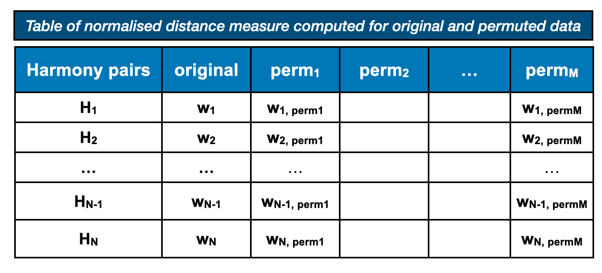

```{r setup, include=FALSE}
library(knitr)
options(htmltools.dir.version = FALSE, tibble.width = 55, tibble.print_min = 4)
opts_chunk$set(
  echo = FALSE, warning = FALSE, message = FALSE, comment = "#>",
  fig.path = 'figure/', cache.path = 'cache/', fig.align = 'center', 
  fig.width = 12, fig.show = 'hold', fig.height = 7, # 16:9
  cache = TRUE, external = TRUE, dev = 'svglite',
  results = "markup"
)
read_chunk('R/theme.R')
read_chunk('R/main.R')
```

```{r xaringan-themer, include = FALSE, eval=FALSE}
library(xaringanthemer)
 solarized_dark(
   header_font_google = google_font("Josefin Sans"),
   text_font_google   = google_font("Montserrat", "300", "300i"),
   code_font_google   = google_font("Droid Mono"),
   # header_color = "#00aba9",
   # text_color = "#2b5797"
   # # header_color = "#00008B",
   # text_color = "#8B4513"
  header_color = "#ffbb33",
  # text_color = "#FFDAB9",
  text_color = "White",
  background_color = "#555555",
  #title_slide_background_color = " #D9D690"
 )
```


```{r load}

```

# Motivation: Electricity smart meter data 

```{r motivation}

```

---
# Characteristics of electricity demand across time

```{r load-elecnew, message = FALSE, warning=FALSE}
```

```{r elec-rawnew}

```

.smaller[
.smaller[
missing observations, unequal length, different start and end date
, no behavioral pattern visible in the squeezed linear representation, many households
]
]


---

class:top, center

# Research roadmap

```{r theme, out.width="80%"}
```


???

thisd is mynotes 
---

class:left, top

#  Papers

- Visualizing probability distributions across bivariate cyclic temporal granularities (tentatively accepted in JCGS in March, 2021) <br><br>
- A new metric for automatic discovery of periodic patterns in time series (draft prepared and incorporating comments from supervisors) <br><br>
- Clustering of residential Australian smart meter customers (draft in preparation)

---


class: middle center

<!-- SLIDE 4 -->

.animated.bounce[

]

## Visualizing probability distributions across bivariate cyclic temporal granularities


---

# Main contributions

 - provide a formal characterization of cyclic granularities;
 - facilitate manipulation of single- and multiple-order-up time granularities through cyclic calendar algebra;
 - develop an approach to check the feasibility of creating plots or drawing inferences for any two cyclic granularities.

---
class: top left 

# Linear to cyclic

.pull-left[
.checked[
.smaller[
- **Cyclic time granularities:** exploring different periodicities e.g. hour-of-day, day-of-month or  hour-of-week, day-of-semester
- **Multiple observations** for each level of cyclic granularity
- **summarize distribution** of measured variables
]
]
]

.pull-right[
```{r linear2cyclic, dev='png', interval=0.2}
```
]

---

# Graphing distribution summary


```{r allplots}
```


**_several ways to summarize a distribution_**


---
class: top left

# Data structure and graphical mapping

.left-column[
<br>
<br>
-  extension of tsibble data structure
-  choose any two cyclic granularities: 
$C_i = \{A_1, A_2, \dots, A_K\}$ and $C_j = \{B_1, B_2, \dots, B_L\}$
- graphical mapping $(C_i, C_j, v)$

- $^{N_C}P_2$ displays
]

.right-column[

```{r graphical map, out.width="90%"}

```

]
---
class:left, top

# Relationship of cyclic granularities

.left-column[
<br>
.larger[
**<span style="color:firebrick"> <i> Clashes</i>:** pairs leading to empty sets
<br>
<br>
**<span style="color:firebrick"> <i> Harmonies</i>:** pairs leading to no empty sets
]
]

.right-column[

```{r clash, out.width="100%"}
```
```{r noclash, out.width="100%"}
```

```{r bothclash2, out.width="100%"}
```

]

**_Still too many harmonies for display for large $N_C$_**

---
class: top left

# Show me significant harmonies only

<!-- SLIDE 4 -->
<br>
<br>
##  Project 2: A new metric for automatic discovery of periodic patterns in time series

---

# Project 2: Contributions

 - introduce a new distance measure for quantifying periodic interactions;
 - device a framework for choosing a threshold for detecting only significantly interesting periodic patterns;
 - show that the proposed distance metric is useful for ranking different periodic patterns since they have been normalized for relevant parameters.

---


# Project 2: Idea

.left-column[
<br>
.smaller[
- Rank harmonies $a (D_{null}) < b (D_{var_f})$  
$<  c(D_{var_x}) < d(D_{var_{all}})$
- Gestalt theory
- within and between facet variation/distances
- compute a threshold
]
]


.right-column[
```{r example-design2, out.width="100%"}
```
]
---

# Project 2: Notations
```{r dist-explain}
```

<small>
- two cyclic granularities $A$ and $B$ placed across x-axis and facet respectively. 
- $A = \{ a_j: j = 1, 2, \dots, J\}$ and $B = \{ b_k: k = 1, 2, \dots, K\}$
- within-facet distances $(a_{j}b_{k}, a_{j'}b_{k})$
- between-facet distances $(a_{j}b_{k}, a_{j}b_{k'})$

---
# Project 2: Computation

## Characterizing distributions through quantiles

.small[
- $Q(p)=F^{-1}(p) = inf\{x: F(x) >p\}$, where $F(x)$: distribution function, $Q(p)$: Population quantile with probability $0<p< 1$.
- Non-parameteric estimators : Sample quantiles
- Median-unbiased estimate of Q(p) regardless of the distribution $p_{(k)} = \frac{(k-1/3)}{(n+1/3)}$
]

.smaller[
.smaller[
.footnote[
Hyndman, Rob J., and Yanan Fan. 1996. “Sample Quantiles in Statistical Packages.” The American Statistician 50 (4): 361–65.
]
]
]

---


# Project 2: Computation (continued)

## Make asymmetrical distributed real world observed variables more treatable

.smaller[
The empirical **Normal Quantile Transform** involves the following steps:

  1. 1) Sort the sample of measured variable $X$ from the smallest to the largest observation $x_{(1)},\dots, x_{(i)}, .., x_{(n)}$.
  2. 2) Estimate the cumulative probabilities $p_{(1)},\dots, p_{(i)}, .., p_{(n)}$.
  3. 3) Transforming each observation $x_{(i)}$ of $X$ into observation $y_{(i)} = Q^{-1}(p(i))$ of the standard normal variate $Y$ , with $Q$ denoting the standard normal distribution and $Q^{-1}$ its inverse.
]

.smaller[
.smaller[
.smaller[
.footnote[
Bogner, K., F. Pappenberger, and H. L. Cloke. 2012. “Technical Note: The Normal Quantile Transformation and Its Application in a Flood Forecasting System.” Hydrology and Earth System Sciences 16 (4): 1085–94.
]
]
]
]

---
# Project 2: Computation (continued)

## Computing distance between distributions using Jensen-Shannon distance

$$JSD(q_1||q_2) = \frac{1}{2}D(q_1||M) + \frac{1}{2}D(q_2||M)$$
where $M = \frac{q_1+q_2}{2}$ and 
$D(q_1||q_2) := \int^\infty_{-\infty} q_1(x)f(\frac{q_1(x)}{q_2(x)})$ is the KL divergence between distributions $q_1$ and $q_2$.  


.smaller[
.smaller[
.smaller[
.footnote[
Bogner, K., F. Pappenberger, and H. L. Cloke. 2012. “Technical Note: The Normal Quantile Transformation and Its Application in a Flood Forecasting System.” Hydrology and Earth System Sciences 16 (4): 1085–94.
]
]
]
]
---

# Project 2: Algorithm for computing $wpd$
```{r algorithm1, out.width="80%"}
```
---
# Project 2: Simulation setup

.smaller[
- Design correspond to $D_{null}$
- $nx = nfacet =  \{2, 3, 5, 7, 14, 20, 31, 50\}$  
- Observations are generated from a Gamma(2,1) distribution for each combination of $nx$ and $nfacet$
- $ntimes = 500$ observations are drawn for each combination of the categories
- For eg, for the panel with $\{nx = 2, nfacet = 2\}$, $500$ observations are generated for each of $\{(1, 1), (1, 2), (2, 1), (2, 2)\}$
- Data is simulated for each of the panels $nsim=200$ times
- $wpd$ computed for each of the simulation and panel for $\lambda =  0.67$
]

<!--  _ **nx** (number of x-axis categories), **nfacet** (number of facet categories), **nsim** (number of simulations to draw the distribution, **ntimes** (number of observations per combination), $\lambda$ (value of tuning parameter)_ -->

<!-- ### Values -->

<!-- $nx = \{2, 3, 5, 7, 14, 20, 31, 50\}$   -->
<!-- $nfacet = \{2, 3, 5, 7, 14, 20, 31, 50\}$   -->
<!-- $nsim=200$   -->
<!-- $ntimes = 500$   -->
<!-- $\lambda =  0.67$   -->


---

# Project 2: Null distribution of $wpd$ 

```{r raw-dist}

```

**_Distribution changes across different comparisons_**
---


# Project 2: Need to normalize

<br>

$wpd$ values are meant to be different only when there is difference between different categories and not when 

- underlying distributions are different
(solved by using NQT)
- number of categories are different
(solved by normalizing for the number of categories)

---

# Project 2: Normalization approach (Permutation)

```{r permutation-test, fig.height=5}

```
.smaller[
.smaller[
- $wpd_{orig}$ : $wpd$ computed for original data
- $wpd_{perm_i}$: $wpd$ computed for $i^{th}$ permutation of data
- Repeated for many (200) permutations
- $wpd_{norm} =  \frac{(wpd_{orig} - \bar{wpd_{perm}})}{\sigma(wpd_{perm})}$
**_Computationally expensive_**

]
]


---
# Project 2: Simulation results (Permutation)

```{r perm-dist, out.width="90%"}

```

.smaller[
**_Location and scale of distributions look similar for different comparisons_**
]
---
# Project 2: Normalization approach (GLM)

.pull-left[

.smaller[
$y = a+b*log(z) + \epsilon \quad \epsilon \sim IID$
]

.smaller[
.smaller[
- Response: $y = median(wpd)$
- Linear predictor: $z = log(nx*nfacet)$
- Distribution: Gamma
- Link function (g): inverse
- $E(y) = \mu$  
- $g(\mu)=  1/\mu$  
- $\hat \mu  = 1/(\hat a + \hat b log(z))$
- Residuals: $y - \frac{1}{\hat a + \hat b*log(z)}$
- $wpd_{norm} = Residuals$
]
]
]

.pull-right[

```{r glm2, out.width="100%"}
```

]

**_ The normalized measure is chosen as residuals to make it independent of the linear predictor_**

---
# Project 2: Simulation results (GLM)

```{r glm-dist, out.width="90%"}

```

**_Locations of distributions for different comparison look similar for higher levels, but not scale_**

---
# Project 2: Combination approach for different comparisons

```{r same-scale, out.width="90%"}
```

.smaller[
**_The two approaches mostly overlap for higher levels and are different for smaller levels. Hence, permutation for smaller levels and model for higher level is chosen as normalization method for computational efficiency._**
]
---

# Project 2: Choosing a threshold and significant harmonies


```{r, out.width="70%"}

```

.smaller[
.smaller[

.pull-left[
**Threshold**  
- $wpd_{threshold}$ = $99^{th}$ percentile of $wpd_{perm}$  
.smaller[
where, $wpd_{perm}=\{w_{1,perm_{1}},w_{1,perm_{2}},\dots, w_{N, permM}\}$
]
]
.pull-right[
**Selection criterion**    

**<span style="color:black"> for** $(i \in {1, 2, \dots, N})$  
**<span style="color:black">if** $w_i > wpd_{threshold}$ _select_  
**<span style="color:black"> else**  _reject_  
]  
  
- The threshold is defined for 99% but can be extended to define for 95% and 90% significance levels by choosing appropriate percentiles 

]
]
---

# Melbourne households example: show me the data

```{r heatplot-call3}
```


---
#  Melbourne households example: systematic search

```r
elec %>% 
*  search_gran(lowest_unit = "hour",
*              highest_unit = "month", 
*              filter_in = "wknd_wday", 
*              filter_out = "fortnight")
```

```{r search-gran}

```
<br>

- There are $^{7} P_2 = 42$ pair of granularities to look at looking at two at a time.
- 42 visualizations to interpret?

---
#  Melbourne households example: harmonies

```{r harmony}
```

.smaller[
- only 14 out of 42 are harmonies <br>
- plotting other 28 pairs lead to empty combinations
]

---
#  Melbourne households example: significant harmonies

```{r rank-table, out.width="60%"}
```
.smaller[
- Only 2 or 3 harmony pairs out of 14 are significant for any household 
- Significant pairs differ across households
]
---
#  Melbourne households example: validate one household

```{r gravitas-plot, fig.height=8}

```

---
#  Melbourne households example: compare households


---
class: top left


# Compare and analyze many households?

<br>
<br>
<br>

## Project 3: Clustering Australian residential demand

---

# Project 3: Main contributions

- present a cluster analysis of SGSC dataset to group households with similar periodic behavior;
- cluster validation through simulations and relating to external data like census and geography [Australian Bureau of Statistics](https://www.abs.gov.au/websitedbs/censushome.nsf/home/tablebuilder) along with weather from [Bureau of Meteorology](www.bom.gov.au)

---
# Project 3: Preliminary exploration

.smaller[
_Getting to know the SGSC dataset using missingness/ number of observations/number of customers and their related information_
]

```{r elec-gaps, warning=FALSE}
```

```{r count-gaps, out.width="80%"}

```

.smaller[
.smaller[
**_The missing data pattern for 100 households are shown. It looks like most missingness happens before 2013 and for a particular data in 2014._**
]
]
.smaller[
.smaller[
.smaller[
Wang, Earo, Dianne Cook, and Rob J. Hyndman. 2020. “A New Tidy Data Structure to Support Exploration and Modeling of Temporal Data.” Journal of Computational and Graphical Statistics
]
]
]

---

# Project 3: Notations and Methodology

.smaller[

- $f_s(v)$: distribution of household $s$ and $v$ is electricity demand
- $(A, B)$: harmony pair such that $A = \{ a_j: j = 1, 2, \dots, J\}$ and $B = \{ b_k: k = 1, 2, \dots, K\}$
- $J*K$ distributions of the form $f_s^{j, k}(v)$ for each combination of categories for household $s$
- $wpd_{norm_s}(A,B)$: distance measure for the harmony pair $(A, B)$
- clustering algorithm on these $wpd_{norm_s}(A,B)$ instead of raw data
]
---
class:left, top

# Project 3: Implications for using probability distributions

- Dimension reduction
- Robust to outliers by trimming the tails
- Robust to missing observations
- Non-synchronized observed time periods
- Similar periodic behavior

---
.left-column[
## Timeline
### - 2020
]
.right-column[
.timeline.timeline-left.purple-flirt.timeline-with-arrows[


.timeline-block[
.arrow-right[
.timeline-content[
Mid-Candidature Review
.timeline-date[
2020/03
]]]]


.timeline-block[
.arrow-right[
.timeline-content[
Paper submitted to Journal of Computational and Graphical Statistics (JCGS)
.timeline-date[
2020/09
]]]]
]
]

---

.left-column[
## Timeline
### - 2020
### - 2021
]

.right-column[
.timeline.timeline-left.purple-flirt.timeline-with-arrows[

.timeline-block[
.arrow-right[
.timeline-content[
Pre-submission Review 
.timeline-date[
2021/03
]]]]

.timeline-block[
.arrow-right[
.timeline-content[
Paper 2 ready for submission
.timeline-date[
2021/04
]]]]

.timeline-block[
.arrow-right[
.timeline-content[
Paper 3 ready for submission
.timeline-date[
2021/06
]]]]


.timeline-block[
.arrow-right[
.timeline-content[
Thesis submission `r emo::ji("v")`
.timeline-date[
2021/08
]]]]
]
]

---
class: middle center

# Thank you

<br>
## Rob J Hyndman & Dianne Cook
<br>
### <span style="color:black"> Panel members
<br>

### <span style="color:black"> <small> NUMBATS
### <span style="color:black"> <small> Monash Data Fluency community
### <span style="color:black"><small> MonARCH (high performance computing cluster)


Slides created with <i> Rmarkdown, knitr, xaringan, xaringanthemer</i> and template created by [Emi Tanaka](https://github.com/emitanaka/MBATemplate)  

