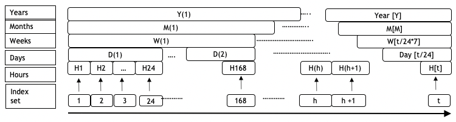

```{r setup, include=FALSE}
library(knitr)
options(htmltools.dir.version = FALSE, tibble.width = 55, tibble.print_min = 4)
opts_chunk$set(
  echo = FALSE, warning = FALSE, message = FALSE, comment = "#>",
  fig.path = 'figure/', cache.path = 'cache/', fig.align = 'center', 
  fig.width = 12, fig.show = 'hold', fig.height = 7, # 16:9
  cache = TRUE, external = TRUE, dev = 'svglite',
  results = "markup"
)
read_chunk('R/theme.R')
read_chunk('R/main.R')
```

```{r xaringan-themer, include = FALSE, eval=FALSE}
library(xaringanthemer)
 solarized_dark(
   header_font_google = google_font("Josefin Sans"),
   text_font_google   = google_font("Montserrat", "300", "300i"),
   code_font_google   = google_font("Droid Mono"),
   # header_color = "#00aba9",
   # text_color = "#2b5797"
   # # header_color = "#00008B",
   # text_color = "#8B4513"
  header_color = "#ffbb33",
  # text_color = "#FFDAB9",
  text_color = "White",
  background_color = "#555555",
  #title_slide_background_color = " #D9D690"
 )
```


# Electricity smart meter technology <br> (~ 0.3 billion half hourly observations)

- Source : Department of the Environment and Energy, Australia
<br>
<br>
- Frequency:  Half hourly (interval meter reading (Kwh))
<br>
<br>
- Time Span: 2012 to 2014
<br>
<br>
- Spread: 14K (approx.) households based in Newcastle, New South Wales, and parts of Sydney
<br>
<br>

---

# Raw data from from 2012 - 2014 for 50 households

```{r load}
```


```{r motivation3, out.height="500px"}
```

---
class:center, middle

```{r load-theme}
```


---
class:left, top

#  Research aim 

## **How do we systematically explore large quantities of temporal data across different deconstructions of time (half-hour, day, type of day, year) to find regular patterns or anomalies in behaviour?**

---
class:left, top

#  Research objectives 

 * **Visualizing probability distributions across bivariate cyclic temporal granularities **
 * **Clustering temporal data across cyclic granularities based on probability distribution similarity**
 * **Study of Australian smart meter data**

---
class: middle center

<!-- SLIDE 4 -->

.animated.bounce[

]

## Visualize probability distributions over different time granularities


---
<!-- SLIDE 5 -->

#  Time granularities - abstractions of time
.pull-left[
### Arrangement
<br>
 <i> **Linear**</i>  
 - days, weeks, months, years  
<br>

<i> **Cyclic** </i>

 -  <i> **Circular** </i>   day-of-week, month-of-year or hour-of-day  
 -  <i> **Quasi-circular** </i>   day-of-month, week-of-month   
 -  <i> **Aperiodic** </i>  public holidays, school vacations
]

.pull-right[
### Order 

- <i>**Single-order-up**</i> second-of-minute, hour-of-day  
<br>
<br>
<br>
- <i>**Multiple-order-up**</i> second-of-hour, hour-of-week  

<!-- # ```{r calendar, out.width="100%"} -->
<!-- #  -->
<!-- # ``` -->
]

<!-- --- -->
---
class:  left middle

#  Linear time granularities

<font size="4">
A linear **granularity** is a mapping $G$ from the integers to subsets of the time domain such that: <br>  (C1) if $i < j$ and $G(i)$ and $G(j)$ are non-empty, then each element of $G(i)$ is less than all elements of $G(j)$, and <br> (C2) if $i < k < j$ and $G(i)$ and $G(j)$ are non-empty, then $G(k)$ is non-empty.

```{r linear-time, echo=FALSE, out.width="100%"}

```

<!-- <span style="color:Crimson"> (C1) implies that the granules in a linear granularity are non-overlapping and their index order is same as time order -->

<span style="color:Crimson"> The definitions, properties and calendar algebra inadequate for conceptualizing cyclic granularities

<!-- since the linearity imposes a restriction on reflecting periodicity in time -->
.footnote[
_* "A Glossary of Time Granularity Concepts"* by Bettini et al." _
]
---
class: left middle

# Cyclic time granularities

.smaller[
.checked[

* **Circular**: $C_{B, G}(z) = {L}(z\mod P(B, G))$,  $\forall z \in \mathbb{Z}_{\geq 0}$
* **Quasi-circular**: $Q_{B, G'}(z) = L(z - \sum_{w=0}^{k-1}\vert T_{w \mod R'} \vert)$, $z \in T_k$
* **Aperiodic** : 

\begin{align}
A_{B, M}(z) &= L(i), z \in T_{i_j}, \forall i \in {1, 2, \dots, n} \\
             &= L(0), \text{otherwise}
\end{align}
]
]


---
class:  middle center

## Data structure and Graphical mapping with two cyclic granularities


---
class:  middle center
# Why look at multiple cyclic granularities?
.pull-left[
<!-- <large> $multiple \ cyclic\ granularities \equiv multiple\ perspectives (EDA)$ </large> -->
<br>
<br>
### (1) If certain hours of the day within a week are different?
<br>
<br>
### (2) If certain days of the week are different for different months?
]
.pull-right[
```{r EDA1, out.width = "200%"}
```
```{r EDA2, out.width = "200%"}
```
]

<!-- Exhaustive sets of visual representation required for multiple perspectives on data? -->


<!-- # Computation of granularities -->

<!-- $z$       : index of a tsibble   -->
<!-- <br> -->
<!-- $x$, $y$  : two units in the hierarchy table with  $order(x) <  order(y)$   -->
<!-- <br> -->
<!-- $f(x, y)$ : accessor function for computing the granularity   -->
<!-- <br> -->
<!-- $c(x, y)$ : a constant which relates x and y   -->
<!-- <br> -->

<!-- #### **Single-order-up** -->
<!-- $$f(x, y) = \lfloor z/c(z,x) \rfloor\mod c(x,y)$$ where $y = x+1$ -->


<!-- #### **Multiple-order-up** -->


<!-- \begin{split} -->
<!-- f(x,y) & = \sum_{i=0}^{order(y) - order(x) - 1} c(x, x+i)(f(x -->
<!--   +i, x+i+1) - 1)\\ -->
<!-- \end{split} -->
<!-- SLIDE 7 -->
---
# Relationship of cyclic granularities

.pull-left[
**Clashes** : pairs leading to empty sets
.x[
* structural
* event-based
* build-based
]

**Harmonies** : pairs leading to no empty sets
.checked[
* aid exploratory data analysis
]
]

.pull-right[

```{r clash}
```

```{r noclash}
```
]
---
<!-- SLIDE 7 -->
# Statistical transformations and geometric objects

```{r allplot, out.width= "90%"}
```

---
class:  middle center

<!-- SLIDE 6 -->

# Number of levels on visualization
<!-- If certain  hours of the day are different between weekdays and weekends ? -->

.pull-left[
.checked[

```{r leveltable}

```
<br>
<br>

For example, with too many x-axis levels, avoid ridge plots
]
]

.pull-right[
```{r effectoflevel1, out.width= "100%"}
```

```{r effectoflevel2, out.width= "100%"}
```
]
---
class:  middle center

<!-- SLIDE 6 -->
#  Interchanging the mapping

.pull-left[
.checked[
* Items placed in close proximity assumed to be in the same group 
(_Gestalt theory_)
* Different mapping focus on different periodic behaviors
]
]
.pull-right[
```{r effectofreverse1, out.width= "100%"}
```

```{r effectofreverse2, out.width= "100%"}
```
]

---
class: middle center

# R package: **gravitas**

.center[
### Computation
--- 
.left[
Compute any cyclic granularity? `create_gran()`
 <br>
Exhaustive list of granularities to explore? `search_gran()`
 <br>
       ]
]
 
.pull-left[
 ### Interaction
 --- 
 
Check if cyclic granularities are harmonies/clashes? `is.harmony()`
<br>
List of harmonies to explore? `harmony()`
<br>
 ]
.pull-right[
### Visualization
--- 

Possible probability distributions plots for harmonies? `prob_plot()`
<br>
Sufficient observations? `gran_obs()`  
Recommendation on a harmony? `gran_advice()`
 ]

<!-- class: center,middle -->

<!-- # <span style="color:MediumVioletRed"> Package gravitas </span> -->

<!-- ##   granularity visualization of time series data  -->

<!-- SLIDE 8 -->
---
# Application: Non-temporal case
.left-column[
## Cricket example
.checked[
* the data
<br>
<br>
* Hierachy table
```{r hierarchy2}
```
]
]
.right-column[
```{r cricket-glimpse}
knitr::include_graphics("images/cricket_data.png")
```
]
---

<!-- SLIDE 9 -->
.left-column[
## Cricket example
.checked[
* the data
* search granularities `search_gran()`
]
]
.right-column[

```r
cricket_tsibble <- cricket %>%
*  mutate(data_index = row_number()) %>%
*  as_tsibble(index = data_index)
```

```r
* cricket_tsibble %>%
*  search_gran(hierarchy_model, 
*              lowest_unit = "ball",
*               highest_unit =  "match")
```
.pull-left[
```{r search_gran_cric}
```
]
.pull-right[
<br>
<br>
<large>  So there are $^{6} P_2$ =  `r length(combn(6,2))` pair of granularities to look at.
]
]
---

.left-column[
## Cricket example
.checked[
* the data
* search granularities `search_gran()`
* set of harmonies `harmony()`
]
]
.right-column[
```r
cricket_tsibble %>%
*  harmony(hierarchy_model, 
*          lgran = "ball",
*          ugran =  "match")

```

```{r harmony_gran_cric}
```
### Good news! Only 8 out `r length(combn(6,2))` are harmonies 
]
---

.left-column[
## Cricket example
.checked[
* the data
* search granularities `search_gran()`
* set of harmonies `harmony()`
* advice `gran_advice()`
]
]
.right-column[

```r
cricket_tsibble %>% 
*  gran_advice("hierarchy_model",
*              "over_inning", 
*              "inning_match")
```
<small>
```{r gran-advice_cric, out.width="100%"}
```
</small>
### <large>  Quantile plots recommended for the harmony pair (over_inning, inning_match) </large>
]
---
.left-column[
## Cricket example
.checked[
* the data
* search granularities `search_gran()`
* set of harmonies `harmony()`
* advice `gran_advice()`
* visualize harmonies `prob_plot()`
]
]
.right-column[
```r
cricket_tsibble %>% 
filter(batting_team %in% c("Mumbai Indians",
                           "Chennai Super Kings")) %>%
* prob_plot("inning_match",
*            "over_inning",
*            response = "runs_per_over",
*            hierarchy_model,
*            plot_type = "lv")
```

```{r visualise_cric}
```
]
---
# Application: aperiodic granularities in cricket
```{r aperiodic_cric, fig.height = 7.5}
```
---
class: left, middle

# Clustering temporal data across cyclic granularities <br> based on probability distribution similarity


- Dimension reduction
- Avoid loss of information due to aggregation
- Robustness to outliers
- Non-synchronized observed time periods
- Similar periodic behavior
- Handling autocorrelation

---
class: left, middle

# Clustering temporal data across cyclic granularities <br> based on probability distribution similarity


- $C_1: \mathbb{Z}_+ \mapsto \{L_1, L_2, L_3, \dots, L_m \}$
- $C_2: \mathbb{Z}_+ \mapsto \{L_1, L_2, L_3, \dots, L_p \}$
- $S(i, j, k)$: set of measurement variables corresponding to the key $i$ for $k^{th}$ level of $j^{th}$ cyclic granularity
- $P(i, j, k)$: probability distribution of the measured variable corresponding to the set $S(i, j, k)$
- clustering algorithm on $P(i, j, k)$ instead of raw data

---
class: left, middle

# Study of Australian smart meter data

.smaller[
* Provide preliminary exploratory visualization and summarisation.
* Employ cluster analysis to obtain households showing similar periodic behavior and combine the findings with external data like weather conditions, socio-economic or other demographic factors of those households.
* Comparative study with earlier methods which focussed on clustering raw data across linear time scales as opposed to clustering probability distributions across periodic scales.
]
---

.left-column[
## Timeline
### - 2019
]
.right-column[
.timeline.timeline-left.timeline-with-arrows[
.timeline-block[

.timeline-block[
.arrow-right[
.timeline-content[
Internship with Google Summer of Code
.timeline-date[
2019/08
]]]]

.timeline-block[
.arrow-right[
.timeline-content[
Young Statistician's Conference -  
won the 2nd best Presentation award `r emo::ji("trophy")`
.timeline-date[
2019/10
]]]]

.timeline-block[
.arrow-right[
.timeline-content[
R package `gravitas` on CRAN
.timeline-date[
2019/11
]]]]

.timeline-block[
.arrow-right[
.timeline-content[
R package `gghdr`: graphing highest density regions at [rOpenSci](https://ropensci.org/) 
.timeline-date[
2019/12
]]]]


.timeline-block[
.arrow-right[
.timeline-content[
International Indian Statistical Association 
.timeline-date[
2019/12
]]]]

]
]
]

---

.left-column[
## Timeline
### - 2019
### - 2020
]
.right-column[
.timeline.timeline-left.purple-flirt.timeline-with-arrows[


.timeline-block[
.arrow-right[
.timeline-content[
Mid-Candidature Review
.timeline-date[
2020/03
]]]]


.timeline-block[
.arrow-right[
.timeline-content[
R package `gghdr` to be submitted on CRAN 
.timeline-date[
2020/03
]]]]


.timeline-block[
.arrow-right[
.timeline-content[
Paper to be submitted to Journal of Computational and Graphical Statistics (JCGS)
.timeline-date[
2020/04
]]]]

.timeline-block[
.arrow-right[
.timeline-content[
useR! 2020 (Tentative)
.timeline-date[
2020/07
]]]]

.timeline-block[
.arrow-right[
.timeline-content[
Compstat 2020 (Tentative)
.timeline-date[
2020/08
]]]]

.timeline-block[
.arrow-right[
.timeline-content[
R package and Draft paper of Research objective-2 ready
.timeline-date[
2020/10
]]]]
]
]

---

.left-column[
## Timeline
### - 2019
### - 2020
### - 2021
]

.right-column[
.timeline.timeline-left.purple-flirt.timeline-with-arrows[

.timeline-block[
.arrow-right[
.timeline-content[
Pre-submission Review 
.timeline-date[
2018/03
]]]]

.timeline-block[
.arrow-right[
.timeline-content[
Research objective-3 draft paper ready 
.timeline-date[
2018/03
]]]]

.timeline-block[
.arrow-right[
.timeline-content[
Thesis submission `r emo::ji("v")`
.timeline-date[
2020/06
]]]]
]
]
---
class: center middle 

# Thank you

<br>
## Joint work with Rob J Hyndman & Dianne Cook
<br>
<br>
### <span style="color:black"> Special thanks to NUMBATS
<br>
<br>


.footnote[
Slides created with <i> Rmarkdown, knitr, xaringan, xaringanthemer</i>
]
--

